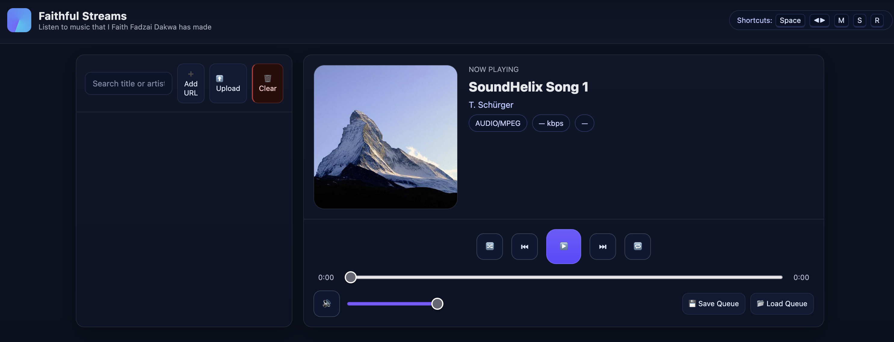

🎵 Faithful Streams – Web Music Player

Faithful Streams is a lightweight, browser-based music streaming player built with vanilla JavaScript and the HTML5 `<audio>` element.  
It allows you to stream, upload, and organize audio tracks directly in the browser.

---

 Features
- Playlist Management – Queue, search, and filter tracks
- Playback Controls – Play, pause, next, previous, seek, and volume
- Shuffle & Repeat– Supports "off", "repeat one", and "repeat all"
- Save/Load Queue – Persist playlist and playback state in RDS Database
- Local File Support – Upload audio files or drag & drop into the player
- Media Session API– Integrates with OS-level media controls
- Bitrate & File Size Estimation– Displays audio metadata when available
- Responsive UI– Playlist view with cover art and now-playing section

---

📸 Screenshots

---

🛠️ Tech Stack
- HTML5
- CSS3
- JavaScript (ES6+)
